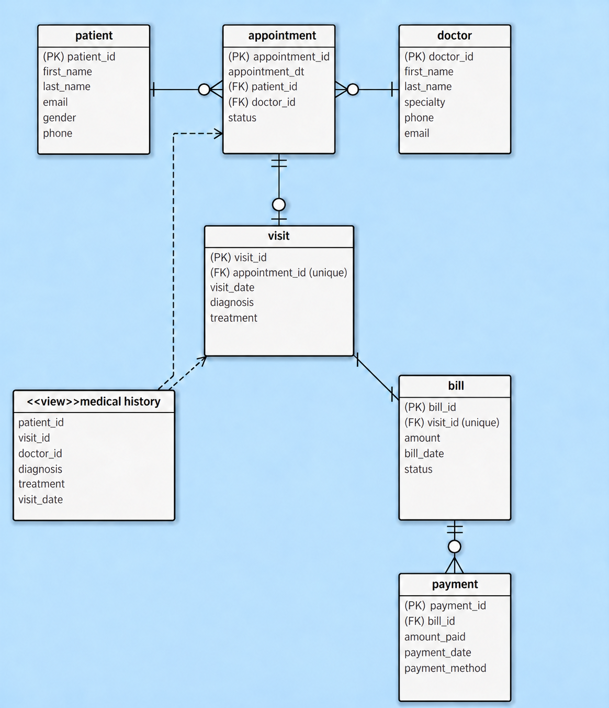

# Medical Clinic Database - Group 6

DBAD-4000: Class Activity - Implementing and Querying a Relational Database

This project implements a medical clinic database in PostgreSQL. It stores patients, doctors, appointments, visits, bills, and payments, and uses SQL queries to answer questions about clinic activity and billing. The `medical_history` view combines appointments and visits to display each patient's diagnoses and treatments.

All sample patient records and fees are fictional coursework data.

## Repository Contents

| Path | Contents |
| --- | --- |
| [diagrams/EERD.png](diagrams/EERD.png) | Entity relationships, keys, and the medical history view. |
| [sql/schema.sql](sql/schema.sql) | Six tables, primary and foreign keys, constraints, and indexes. |
| [sql/data.sql](sql/data.sql) | Sample records and identity sequence resets. |
| [sql/views.sql](sql/views.sql) | Definition of `public.medical_history`. |
| [sql/query/](sql/query/) | Eight SQL files containing ten queries. |
| [screenshots/](screenshots/) | Saved query results. |
| [export/sait_medical_clinic_full.sql](export/sait_medical_clinic_full.sql) | Full PostgreSQL export with schema, data, view, indexes, constraints, and sequence values. |
| [Group report](Class%20Activity%20Implementing%20and%20Querying%20a%20Relational%20Database.pdf) | Query explanations and team contributions. |

The PDF report is stored in the repository root. The `report/` folder currently contains only a placeholder.

## Database Design

Database: `sait_medical_clinic`, schema: `public`.



| Table | Purpose | Sample rows |
| --- | --- | ---: |
| `patient` | Patient names and contact details. | 24 |
| `doctor` | Doctor names, specialties, and contact details. | 20 |
| `appointment` | Appointment time, patient, doctor, and status. | 90 |
| `visit` | Completed visit date, diagnosis, and treatment. | 72 |
| `bill` | Amount billed, bill date, and payment status. | 72 |
| `payment` | Individual payments, dates, and payment methods. | 84 |

There are 362 sample rows across the six tables. Each table contains at least 20 records. The appointments include completed, scheduled, cancelled, and no-show appointments.

### Relationships and Business Rules

- Each appointment belongs to one patient and one doctor. Patients and doctors can each have multiple appointments.
- An appointment can have zero or one visit. Every visit references one appointment.
- A visit should have one bill. The unique `bill.visit_id` allows at most one bill per visit.
- A bill can have zero or multiple payments, supporting unpaid bills and payments made in installments.
- `medical_history` is a regular view derived from `visit` and `appointment`. It includes `patient_id`, `visit_id`, `doctor_id`, `diagnosis`, `treatment`, and `visit_date` without storing a separate history table.

The schema enforces primary keys, foreign keys, unique references, required fields, positive amounts, and allowed status and payment-method values. Cross-table rules, such as creating a bill for every visit, preventing overpayment, updating bill status, and keeping dates in order, must be maintained through application logic or database transactions. The current scripts do not automate these rules with triggers.

## Setup and Execution

Use PostgreSQL 18 and its `psql` client. The full export was generated with `pg_dump` 18.6. Run the commands below from the repository root. Replace `postgres`, the host, or the port if your connection uses different settings; PostgreSQL may prompt for your password.

### Build from the SQL Scripts

Create an empty database:

```sh
psql -X -h localhost -p 5432 -U postgres -d postgres -v ON_ERROR_STOP=1 -c "CREATE DATABASE sait_medical_clinic;"
```

Run the scripts in this order:

```sh
psql -X -h localhost -p 5432 -U postgres -d sait_medical_clinic -v ON_ERROR_STOP=1 -f sql/schema.sql
psql -X -h localhost -p 5432 -U postgres -d sait_medical_clinic -v ON_ERROR_STOP=1 -f sql/data.sql
psql -X -h localhost -p 5432 -U postgres -d sait_medical_clinic -v ON_ERROR_STOP=1 -f sql/views.sql
```

`schema.sql` creates objects inside the connected database; it does not create the database itself. Run the schema and data scripts once in an empty database. The data script inserts explicit sample IDs and advances the identity sequences for future inserts.

In Navicat or pgAdmin, create the database first, connect to `sait_medical_clinic`, and execute `schema.sql`, `data.sql`, and `views.sql` in that order.

### Restore the Full Export

The export provides an alternative to the three scripts above. To restore it into a separate empty database:

```sh
psql -X -h localhost -p 5432 -U postgres -d postgres -v ON_ERROR_STOP=1 -c "CREATE DATABASE sait_medical_clinic_restore;"
psql -X -h localhost -p 5432 -U postgres -d sait_medical_clinic_restore -v ON_ERROR_STOP=1 --single-transaction -f export/sait_medical_clinic_full.sql
```

Use the PostgreSQL 18 `psql` client for this file because it contains `COPY ... FROM stdin` and `psql` commands, including `\restrict`. Choose either the script setup or the export for a given empty database; importing both into the same database causes object and record conflicts.

### Run a Query

For example, calculate the clinic's total billed amount:

```sh
psql -X -h localhost -p 5432 -U postgres -d sait_medical_clinic -v ON_ERROR_STOP=1 -f sql/query/03_total_amount_billed.sql
```

Use `-d sait_medical_clinic_restore` instead if you used the export restore above. Quote filenames containing spaces:

```sh
psql -X -h localhost -p 5432 -U postgres -d sait_medical_clinic -v ON_ERROR_STOP=1 -f "sql/query/04_total_appointments _count_Tristan.sql"
```

## Query Guide

| Question | SQL file | Result screenshot |
| --- | --- | --- |
| Count all patients. | [query_01_count_patients.sql](sql/query/query_01_count_patients.sql) | [Patient count](screenshots/Query%20patient%20count.png) |
| Count unique patients who visited last month. | [clinic_three_queries-seth.sql - Query 1](sql/query/clinic_three_queries-seth.sql) | [002_OUTPUT.png](screenshots/002_OUTPUT.png) |
| Calculate the total amount billed to all patients. | [03_total_amount_billed.sql](sql/query/03_total_amount_billed.sql) | [03_result.png](screenshots/03_result.png) |
| Count all appointments using aggregation. | [04_total_appointments _count_Tristan.sql](sql/query/04_total_appointments%20_count_Tristan.sql) | [04_result_Tristan.png](screenshots/04_result_Tristan.png) |
| Use subqueries and joins to show appointment, billing, and payment totals for patients with a completed appointment. | [query_02_subqueries_joins.sql](sql/query/query_02_subqueries_joins.sql) | [Part 1](screenshots/Query%20subquery%20joins%20sc%201.png), [Part 2](screenshots/Query%20subquery%20joins%20sc%202.png) |
| Find patients with at least two visits using `GROUP BY` and `HAVING`. | [clinic_three_queries-seth.sql - Query 2](sql/query/clinic_three_queries-seth.sql) | [006_OUTPUT.png](screenshots/006_OUTPUT.png) |
| Display patient medical histories through a view. | [07_medical_history_view.sql](sql/query/07_medical_history_view.sql) | [07_view_result.png](screenshots/07_view_result.png) |
| Find each doctor's two highest-billed patients using `ROW_NUMBER()`. | [07_two_highest-billed_patients_Tristan.sql](sql/query/07_two_highest-billed_patients_Tristan.sql) | [08_result_Tristan.png](screenshots/08_result_Tristan.png) |
| Compare monthly visits and billing using `LAG`. | [09_monthly_visits_and_billing.sql](sql/query/09_monthly_visits_and_billing.sql) | [09_result.png](screenshots/09_result.png) |
| Find doctors with above-average total billing and calculate their share of all clinic billing. | [clinic_three_queries-seth.sql - Query 3](sql/query/clinic_three_queries-seth.sql) | [010_OUTPUT.png](screenshots/010_OUTPUT.png) |

The top-two-patients SQL file retains its original `07_` filename, while its screenshot uses `08_`. The query returns up to two patients per doctor; equal totals may be selected in either order.

The last-month query uses the previous calendar month relative to the database session's `CURRENT_DATE`. Its results can change as time passes, even when the sample data stays the same. The above-average-doctor query includes doctors with no bills when calculating the average.

## Expected Sample Results

The sample data covers July through September 2026, with the latest visit and bill dated September 25. Total billed is **$10,957.50**, including paid, partially paid, and unpaid bills. This is the amount billed, not the amount collected in payments.

| Month | Visits | Visit change | Total billed | Billing change |
| --- | ---: | --- | ---: | --- |
| 2026-07 | 18 | N/A | $2,872.00 | N/A |
| 2026-08 | 24 | +6 (+33.33%) | $3,572.00 | +$700.00 (+24.37%) |
| 2026-09 | 30 | +6 (+25.00%) | $4,513.50 | +$941.50 (+26.36%) |

The monthly query counts visits by `visit_date` and billing by `bill_date`, then compares each month with the previous month. It aggregates the two separately so multiple payments cannot duplicate billed amounts. The first month has no previous month, so its change columns are `NULL`.

## Team Contributions

Contributions listed in the group's PDF report:

| Team member | Contribution |
| --- | --- |
| Seth Garciano | Last-month patient count, `GROUP BY` with `HAVING`, and above-average doctor billing with clinic billing shares. |
| Tristin Bates | Appointment-count aggregation, each doctor's top two highest-billed patients, and query explanations. |
| Troy Franks | EERD diagram, total patient count, and the query using subqueries and joins. |
| Yisong Wang | Database schema and sample data, medical history view, total billed query, view query, and monthly visits and billing comparison. |

Existing filenames use `Tristan`; the team member's name above follows the report's spelling, `Tristin Bates`.
